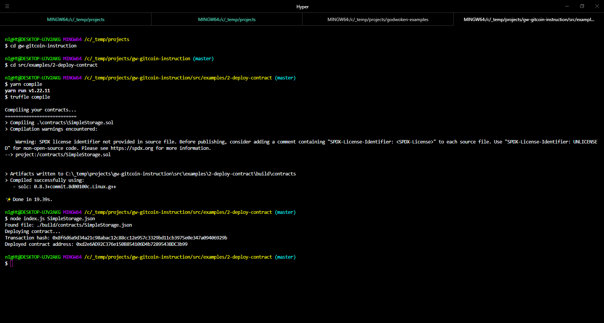

# Gitcoin Task 2

## 1. Screenshot of Smart Contract Deployment



## 2. Transaction Hash from the Contract Deployment
```
Transaction hash: 0x8f6d6a9d34a21c98abac12c88cc12e957c3329bd11cb3975e0e347a09406929b
```

## 3. Deployed Contract Address
```
Deployed contract address: 0xd2e6AD92C376e150B854106D4b7289543BDC3b99
```
