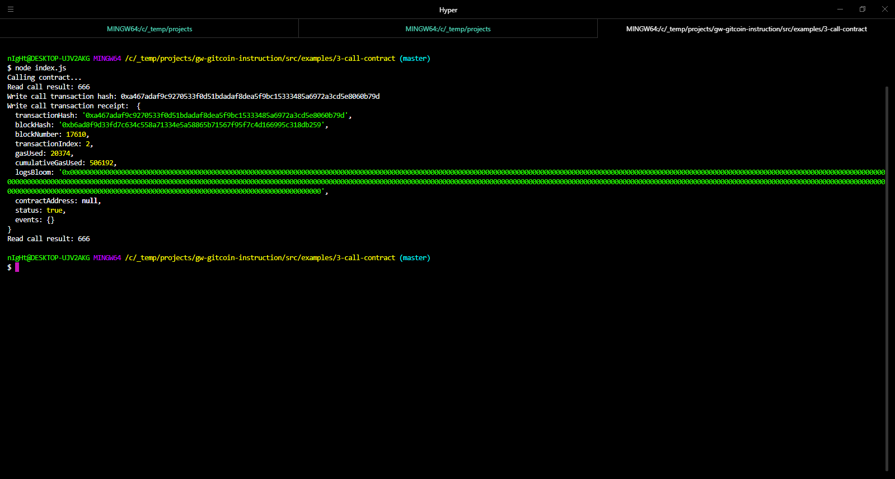

# Gitcoin Task 3

## 1. Screenshot of Smart Contract Call



## 2. Transaction Hash from the Smart Contract Call
```
Transaction hash: 0xa467adaf9c9270533f0d51bdadaf8dea5f9bc15333485a6972a3cd5e8060b79d
```

## 3. Deployed Contract Address
```
Deployed contract address: 0xd2e6AD92C376e150B854106D4b7289543BDC3b99
```

## 4. Smart Contract ABI
```js
const CONTRACT_ABI = [
  {
    "inputs": [],
    "stateMutability": "payable",
    "type": "constructor"
  },
  {
    "inputs": [
      {
        "internalType": "uint256",
        "name": "x",
        "type": "uint256"
      }
    ],
    "name": "set",
    "outputs": [],
    "stateMutability": "payable",
    "type": "function"
  },
  {
    "inputs": [],
    "name": "get",
    "outputs": [
      {
        "internalType": "uint256",
        "name": "",
        "type": "uint256"
      }
    ],
    "stateMutability": "view",
    "type": "function"
  }
];
```
