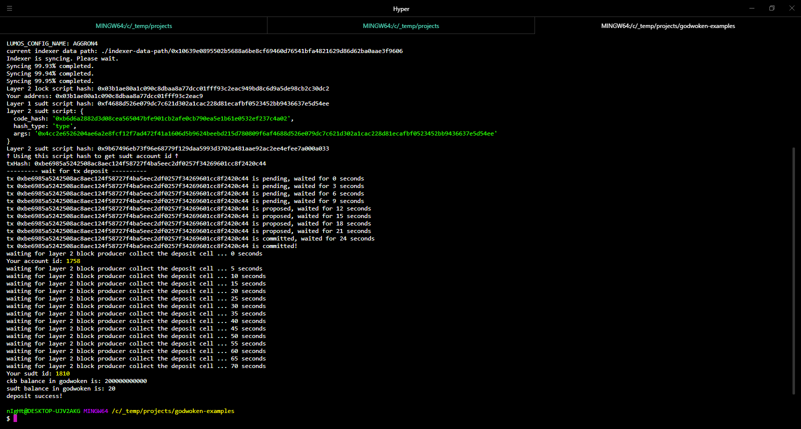

# Gitcoin Task 4

## 1. Layer 1 Founded Account

https://explorer.nervos.org/aggron/address/ckt1qyqrzcdvx7zhrhezs86sulyq02gq7nzgvlvsawmnw9


## 2. Screenshot of `sudt-cli` Output


## 3. Transaction ID

https://explorer.nervos.org/aggron/transaction/0xf149fb3573d6f33ea3238ff9953f27732177eb692046029830dc86d47a4aa361


## 4. Screenshot of Layer 2 Deposit




## 5. SUDT ID Output after Deposit

```
SUDT ID: 1810
```
