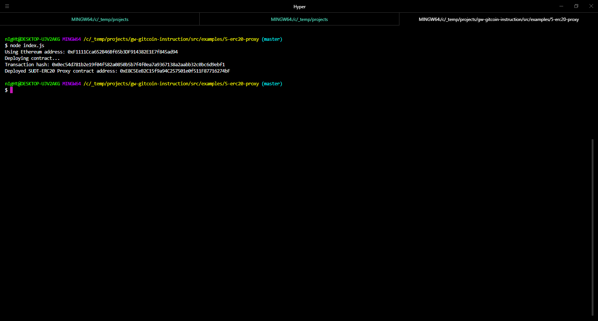

# Gitcoin Task 5

## 1. Screenshot of Smart Contract Deployment Output



## 2. ERC20 Proxy Contract Address
```
ERC20 Proxy contract address: 0xE8C5EeB2C15f9a94C257501e0f511F87716274bF
```


## 3. Screenshot of Checking SUDT Balance Output


## 4. Checked Ethereum Address

```
Ethereum Address: 0xE8C5EeB2C15f9a94C257501e0f511F87716274bF
```
